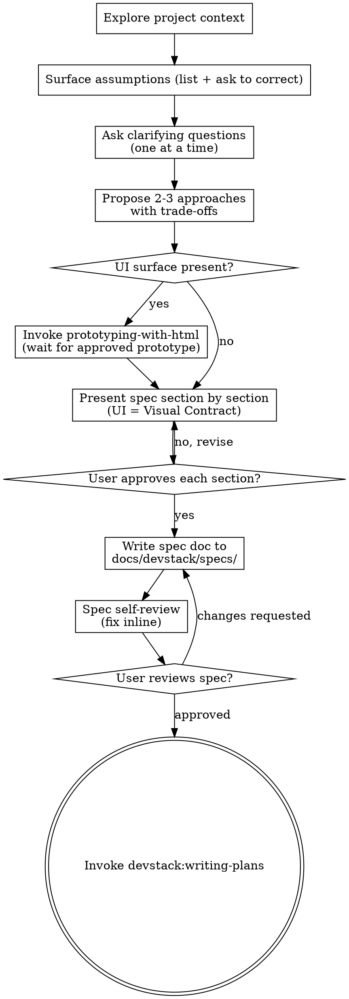

<!--
origin: [SP+AS]
sources:
  - superpowers:brainstorming @ 5.0.7
  - agent-skills:idea-refine @ 1.0.0
  - agent-skills:spec-driven-development @ 1.0.0
notes: |
  Kept SP's HARD-GATE, socratic questioning, visual-companion notion, per-section
  approval loop, and terminal handoff to writing-plans.
  Grafted AS's "Surface Assumptions" pattern as the opening move of the design phase.
  Adopted AS's six-area spec template (Objective / Tech Stack / Commands / Project Structure /
  Code Style / Testing Strategy / Boundaries / Success Criteria / Open Questions) as the
  output format — replacing SP's looser "architecture, components, data flow" guidance with
  AS's more concrete structure. Dropped AS idea-refine's Phase 1–3 taxonomy in favor of
  SP's conversational flow, but kept AS's "Not Doing" list as a required output section.

  v0.5: Inserted a UI Gate between "Propose approaches" and "Present spec section by section".
  For features with a visible end-user surface, brainstorming now hands off to
  devstack:prototyping-with-html, which produces a clickable hi-fi HTML prototype the user
  approves in a real browser. The approved prototype becomes the spec's Visual Contract —
  spec prose no longer re-describes the UI, it points to the prototype path.
-->

# Brainstorming Ideas Into Approved Specs

Turn an idea into a written, approved specification through collaborative dialogue. The spec is the contract between you and your human partner — what you'll build, why, and how you'll know it's done.

For features with a visible UI, an approved **clickable HTML prototype** is part of the contract: the spec references it instead of re-describing the UI in prose. See [UI Gate](#ui-gate).

<HARD-GATE>
Do NOT invoke any implementation skill, write any code, scaffold any project, or take any implementation action until you have presented a design and the user has approved it in writing. This applies to EVERY project regardless of perceived simplicity.
</HARD-GATE>

## Anti-Pattern: "This Is Too Simple To Need A Spec"

Every project goes through this process. A todo list, a single-function utility, a config change — all of them. "Simple" projects are where unexamined assumptions cause the most wasted work. The spec can be short (a few sentences) for truly simple projects, but you MUST present it and get written approval.

## Checklist

Create a TodoWrite task for each of these items and complete them in order:

1. **Explore project context** — files, docs, recent commits, existing patterns
2. **Surface assumptions** — list what you're assuming before asking anything
3. **Ask clarifying questions** — one at a time, understand purpose / constraints / success criteria
4. **Propose 2–3 approaches** — with trade-offs and your recommendation
5. **UI Gate** — does this feature have a visible end-user surface? If yes, invoke `devstack:prototyping-with-html` and wait for an approved prototype + Visual Contract note before continuing
6. **Present design section by section** — get approval after each section (UI section = the Visual Contract from step 5; do not re-describe UI in prose)
7. **Write the spec document** — save to `docs/devstack/specs/YYYY-MM-DD-<topic>-spec.md` and commit
8. **Spec self-review** — inline fix of placeholders, contradictions, ambiguity, scope drift
9. **User reviews written spec** — wait for explicit approval
10. **Hand off to writing-plans** — invoke `devstack:writing-plans` as the terminal state

## Process Flow



**The terminal state is invoking `devstack:writing-plans`.** Do NOT invoke any other implementation skill from here. writing-plans is the only next step.

## The Process

### 1. Explore Project Context

Before asking anything, look. Check directory structure, README, recent commits, existing patterns. If the project has conventions (naming, layering, testing), respect them. New projects: note that context is empty and proceed.

### 2. Surface Assumptions

Before clarifying questions, state what you're assuming — explicitly and in one block:

```
ASSUMPTIONS I'M MAKING:
1. This is a web application (not native mobile)
2. Authentication uses session cookies (based on existing /auth/session route)
3. The database is PostgreSQL (Prisma schema present)
4. Targeting modern browsers only
→ Correct me now or I'll proceed with these.
```

This is the single most effective way to prevent downstream rework. Do not silently fill in ambiguous requirements.

### 3. Assess Scope Early

If the request describes multiple independent subsystems ("build a platform with chat, file storage, billing, analytics"), **flag this immediately** — do not refine details of a project that needs decomposition. Help the user split into sub-projects; each sub-project gets its own spec → plan → implementation cycle.

### 4. Ask Clarifying Questions

- **One question per message.** Don't overwhelm.
- **Prefer multiple-choice.** Easier to answer than open-ended.
- **Focus on:** purpose, constraints, success criteria, who the user is, what "done" looks like.

### 5. Propose 2–3 Approaches

Lead with your recommendation and explain why. Give trade-offs honestly — don't rubber-stamp the first idea that came up.

### 6. UI Gate

Before presenting the spec, decide: **does this feature have a visible end-user surface?**

- **Yes** — pages, screens, modals, dashboards, marketing pages, app flows, component libraries with visible primitives, anything where a human looks at pixels and clicks things
- **No** — CLIs, daemons, background jobs, internal APIs, libraries/SDKs without UI, schema migrations, infra/CI

If yes: hand off to `devstack:prototyping-with-html`. That skill produces a clickable hi-fi HTML prototype the user opens in a real browser, iterates on, and explicitly approves. It returns a **Visual Contract** note (prototype path + locked decisions). Resume here once the prototype is approved.

If no: skip prototyping. The spec is the only contract.

**Why a prototype before the spec?** Words about UI rot fast. A spec sentence "the dashboard has a sidebar with collapsible sections" is consistent with five visually different products. A clickable HTML page is one product. Lock the visual decisions in pixels first, then capture only the non-visual contracts (data, API, edge cases, success criteria) in the spec.

### 7. Present the Spec Section by Section

Scale each section to its complexity. A few sentences for simple parts, up to 200–300 words for nuanced parts. Ask after each section: "Does this look right so far?"

### 8. Design for Isolation and Clarity

As you present the design:

- Break the system into smaller units, each with **one clear purpose**, communicating through **well-defined interfaces**, understandable and testable independently.
- For each unit, be able to answer: **what does it do, how do you use it, what does it depend on?**
- Smaller, well-bounded units are also easier for agents to implement — you reason better about code you can hold in context at once.
- In existing codebases, follow established patterns. Include targeted improvements when the code you're touching has problems that affect the work — but don't propose unrelated refactoring.

## The Spec Template

After approval per section, write the spec to `docs/devstack/specs/YYYY-MM-DD-<topic>-spec.md`. (User preferences override this default path.)

```markdown
# Spec: <Feature/Project Name>

> Status: Approved · <YYYY-MM-DD>

## Objective

What we're building and why. Who the user is. What success looks like.

## Tech Stack

Framework, language, key dependencies with versions.

## Commands

Full executable commands (not just tool names):
- Build: `npm run build`
- Test: `npm test -- --coverage`
- Lint: `npm run lint --fix`
- Dev: `npm run dev`

## Project Structure

Where source code lives, where tests go, where docs belong.

## Code Style

One real snippet + key conventions. (Shows beats describes.)

## Testing Strategy

Framework, test locations, coverage expectations, which test levels for which concerns.

## Visual Contract

> Required for features with a visible UI surface. Omit (or write "N/A — non-UI feature") otherwise.

**Prototype:** `docs/devstack/prototypes/<topic>/index.html`
**Approved:** <YYYY-MM-DD>

**Surfaces locked in:**
- <page/screen> — <one-line purpose>

**Interaction decisions worth calling out:**
- <decision the prototype makes that's not obvious from looking at it>

**Out of scope for this prototype:**
- <thing deliberately not shown / deferred>

(Pulled verbatim from the Visual Contract note returned by `prototyping-with-html`. Do not re-describe the UI in prose elsewhere in the spec — point at the prototype.)

## Architecture

Non-visual components, data flow, error handling. Diagram if useful. Scale to complexity. For UI features, the visible surfaces live in the Visual Contract / prototype, not here — this section covers what the user can't see (data shape, validation, server interactions, state machines).

## Success Criteria

Specific, testable conditions for "done". Not vague — "dashboard LCP < 2.5s on 4G",
not "make it faster".

## Boundaries

- **Always do:** Run tests before commits, follow naming conventions, validate inputs
- **Ask first:** Schema changes, new dependencies, changes to CI config
- **Never do:** Commit secrets, edit vendor directories, remove failing tests without approval

## Not Doing (and Why)

- [Feature X] — out of scope for MVP, revisit in v2
- [Feature Y] — explicitly rejected, see discussion on 2026-04-18
- [Feature Z] — blocked on [prerequisite]

## Open Questions

- [Question needing resolution before implementation]
- [Question that can wait until plan phase]
```

**The "Not Doing" list is non-negotiable.** Focus is saying no to good ideas. Make the trade-offs explicit.

**Reframe vague requests as success criteria.** When told "make the dashboard faster," translate to concrete: "LCP < 2.5s on 4G, initial data load < 500ms, CLS < 0.1 — are these the right targets?"

## Spec Self-Review

After writing the spec, look at it with fresh eyes:

1. **Placeholder scan** — any "TBD", "TODO", incomplete sections, or vague requirements? Fix them.
2. **Internal consistency** — do sections contradict each other? Does the architecture match the feature descriptions?
3. **Scope check** — is this focused enough for a single implementation plan, or does it need decomposition?
4. **Ambiguity check** — could any requirement be interpreted two ways? Pick one and make it explicit.
5. **Assumption audit** — any assumption from step 2 that didn't get confirmed? Flag it in Open Questions.

Fix issues inline. No need to re-review.

## User Review Gate

After self-review, ask:

> "Spec written and committed to `<path>`. Please review it and let me know if you want changes before we move to the implementation plan."

Wait. If the user requests changes, make them and re-run self-review. Only proceed once the user approves.

## Implementation Handoff

```
[User approves spec]

You: I'm using devstack:writing-plans to create the implementation plan based on
     the approved spec at <path>.

[Invoke devstack:writing-plans]
```

Do NOT invoke any other skill. `writing-plans` is the next step.

## Key Principles

- **One question at a time** — don't overwhelm
- **Multiple choice preferred** — easier to answer
- **YAGNI ruthlessly** — remove unnecessary features from all designs
- **Explore alternatives** — always 2–3 approaches before settling
- **Incremental validation** — present, approve, move on
- **Surface assumptions early** — cheaper than rework
- **Be flexible** — go back and clarify when something doesn't make sense
- **Don't be a yes-machine** — if the idea is weak, say so with kindness and specificity

## Red Flags

- Starting to write code with no written spec
- Skipping "Surface Assumptions" because "the request seems clear"
- Batching multiple clarifying questions into one message
- Writing a spec without a "Not Doing" list
- Accepting vague success criteria like "make it faster"
- Jumping to implementation after verbal approval — get written spec approval
- Invoking any skill other than `writing-plans` as the terminal state
- **For UI features:** writing the spec's UI section in prose before invoking `prototyping-with-html`
- **For UI features:** describing screens/layouts in spec prose when an approved prototype exists — the prototype IS the description

## Visual Aids During Brainstorming

For UI features, the heavy visual work happens in `prototyping-with-html` (step 6 — UI Gate). Before reaching that gate, you may still want quick visual aids during early clarifying questions — wireframe sketches, layout comparisons, architecture diagrams. Use whichever lightweight option fits:

- An ASCII layout sketch in chat — great for "row vs. column?", "sidebar left or right?", before any HTML exists
- A mermaid diagram for architecture / state-machine questions
- A one-screen static HTML mockup if a single decision genuinely needs pixels before the full prototype

Keep these aids **disposable** and **focused on the current question**. The full prototype is built in the UI Gate, not piecemeal during clarifying questions.

For non-UI features, ASCII / mermaid is usually all you need.
