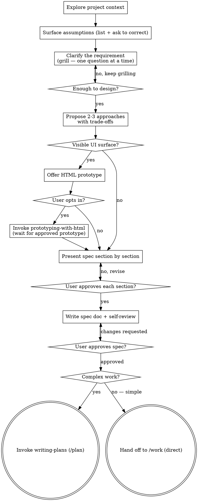

<!--
origin: [SP+AS]
sources:
  - superpowers:brainstorming @ 5.0.7
  - agent-skills:idea-refine @ 1.0.0
  - agent-skills:spec-driven-development @ 1.0.0
notes: |
  Kept SP's HARD-GATE, socratic questioning, visual-companion notion, per-section
  approval loop. Grafted AS's "Surface Assumptions" pattern as the opening move of the
  design phase. Adopted AS's spec template and "Not Doing" list as required output.
  Dropped AS idea-refine's Phase 1–3 taxonomy in favor of SP's conversational flow.

  v0.5: Inserted a UI Gate between "Propose approaches" and "Present spec section by
  section". For features with a visible surface, brainstorming handed off to
  devstack:prototyping-with-html for a clickable hi-fi prototype that became the spec's
  Visual Contract.

  v0.13: Reframed around requirement clarification as the job, with two interchangeable
  clarification tools — adversarial grilling (verbal) and HTML prototyping (visual).
  The UI prototype was demoted from a HARD pre-spec gate to an OPTIONAL, user-opted-in
  clarification aid; when built, it stays the UI source of truth (spec references it, no
  prose re-description). Grilling discipline (one question + recommended answer, boundary /
  failure-mode / reversibility probing — borrowed from challenging-plans) moved into the
  clarify step and scaled to complexity. Terminal state changed from "always writing-plans"
  to a branch: /plan for complex work, straight to /work for simple work — decoupling plan
  from work so simple tasks skip the task-graph ceremony.
-->

# Brainstorming Ideas Into Approved Specs

Brainstorming's job is to **clarify the requirement** until you and your human partner agree on exactly what to build and how you'll know it's done — then record that agreement as a written, approved spec. The spec is the contract.

You have two tools for clarifying, used as the requirement demands:

- **Grilling** (always) — socratic + adversarial questioning. Surface assumptions, probe boundaries and failure modes, push back on weak ideas. This is the main engine. Scale its intensity to the complexity of the request.
- **HTML prototype** (optional, UI only) — when the requirement has a visible surface and words aren't pinning it down, offer to build a clickable hi-fi prototype the user opens in a browser. The user opts in. If built, the prototype becomes the UI source of truth and the spec references it instead of describing the UI in prose.

Clarify first, write the spec second. Thinking the requirement through before implementing is the highest-leverage move available — a wrong line of code is cheap to fix, a wrong requirement is not.

<HARD-GATE>
Do NOT write any code, scaffold any project, or take any implementation action until you have clarified the requirement, presented a design, and the user has approved a written spec. This applies to EVERY project regardless of perceived simplicity.
</HARD-GATE>

## Anti-Pattern: "This Is Too Simple To Need A Spec"

Every project goes through this process. A todo list, a single-function utility, a config change — all of them. "Simple" projects are where unexamined assumptions cause the most wasted work. The spec can be short (a few sentences) for truly simple projects, but you MUST present it and get written approval. Skipping the *plan* on a simple project is fine — it goes straight to `/work` (see [Implementation Handoff](#implementation-handoff)). Skipping the *spec* is not.

## Checklist

Create a TodoWrite task for each of these items and complete them in order:

1. **Explore project context** — files, docs, recent commits, existing patterns
2. **Surface assumptions** — list what you're assuming before asking anything
3. **Clarify the requirement (grill it)** — one question at a time, each with your recommended answer; probe boundaries, failure modes, reversibility; scale intensity to complexity
4. **Propose 2–3 approaches** — with trade-offs and your recommendation
5. **Optional: prototype the visuals** — if the requirement has a visible UI, OFFER `devstack:prototyping-with-html`; if the user opts in, wait for an approved prototype + Visual Contract note
6. **Present design section by section** — approval after each section (if a prototype was built, the UI section IS the Visual Contract — don't re-describe it in prose)
7. **Write the spec document** — save to `docs/devstack/specs/YYYY-MM-DD-<topic>-spec.md` and commit
8. **Spec self-review** — inline fix of placeholders, contradictions, ambiguity, scope drift
9. **User reviews written spec** — wait for explicit approval
10. **Hand off** — branch: complex work → `devstack:writing-plans` (`/plan`); simple work → straight to execution (`/work`). Ask the user which.

## Process Flow



**The terminal state is a branch:** `devstack:writing-plans` for complex work, or straight to `/work` for simple work. Do NOT invoke any other implementation skill from here.

## The Process

### 1. Explore Project Context

Before asking anything, look. Check directory structure, README, recent commits, existing patterns. If the project has conventions (naming, layering, testing), respect them. New projects: note that context is empty and proceed.

### 2. Surface Assumptions

Before clarifying questions, state what you're assuming — explicitly and in one block:

```
ASSUMPTIONS I'M MAKING:
1. This is a web application (not native mobile)
2. Authentication uses session cookies (based on existing /auth/session route)
3. The database is PostgreSQL (Prisma schema present)
4. Targeting modern browsers only
→ Correct me now or I'll proceed with these.
```

This is the single most effective way to prevent downstream rework. Do not silently fill in ambiguous requirements.

### 3. Assess Scope Early

If the request describes multiple independent subsystems ("build a platform with chat, file storage, billing, analytics"), **flag this immediately** — do not refine details of a project that needs decomposition. Help the user split into sub-projects; each sub-project gets its own spec → (optional plan) → implementation cycle.

### 4. Clarify the Requirement — Grill It

This is the core of brainstorming. A clarified requirement is worth more than any amount of careful implementation of the wrong thing. Interrogate the idea until every branch is resolved out loud.

Rules:

- **One question per message.** Don't overwhelm. Don't batch — batched questions get batch hand-waving.
- **For each question, give your recommended answer.** Make the user push back against a position, not against silence.
- **Prefer multiple-choice.** Easier to answer than open-ended.
- **Explore the codebase yourself when the answer lives there.** Use Agent `subagent_type=Explore` rather than making the user recite what's already in the repo.
- **Grill the edges, not the happy path.** Probe boundaries, failure modes, the upgrade path, the rollback story, the second-order consequences.
- **Surface contradictions immediately.** If a term conflicts with an existing `CONTEXT.md` entry or a prior ADR, say so the moment it appears.
- **Don't be a yes-machine.** If the idea is weak, say so with kindness and specificity.

Question types to rotate through:

| Type | Example |
|---|---|
| Purpose | "Who is this for, and what do they do today instead?" |
| Definitional | "When you say 'cancellation' — the user action, the internal state transition, or the refund event?" |
| Boundary | "What happens at the seam between A and B when both write the same record?" |
| Failure mode | "If this step fails halfway, what's the recovery? Idempotent on retry?" |
| Cost | "Worst case, what does this cost — latency, dollars, on-call pages?" |
| Reversibility | "Once shipped, what's the rollback story if this was the wrong call?" |
| Scope | "Is this one change, or three you're hoping to ship as one?" |
| Success | "How will you know it's working — what's the metric, the test, the check?" |

**Scale intensity to complexity.** A one-line config change needs one or two questions; a new subsystem needs the full decision tree. Don't grind a trivial request through twenty questions — that over-coupling is exactly what this skill exists to avoid. But don't wave a complex one through with two, either.

This grilling is the *forward* form — clarifying a requirement that has no artifact yet. The adversarial pass against an artifact that *already exists* (an approved spec, a written plan) is `devstack:challenging-plans` / `/grill`. Same discipline, different moment.

### 5. Propose 2–3 Approaches

Lead with your recommendation and explain why. Give trade-offs honestly — don't rubber-stamp the first idea that came up.

### 6. Optional — Prototype the Visuals

If the requirement has a **visible end-user surface** (pages, screens, modals, dashboards, app flows, visible component primitives) and words alone aren't pinning the look-and-feel down, **offer** a clickable HTML prototype:

> "This has a real UI. Want me to build a quick clickable HTML prototype you can open in a browser before we lock the spec? Fastest way to catch a wrong layout. Or we describe it in the spec and skip the prototype — your call."

- **User opts in** → hand off to `devstack:prototyping-with-html`. It produces a hi-fi prototype the user opens, iterates on, and explicitly approves, then returns a **Visual Contract** note (prototype path + locked decisions). The prototype becomes the UI source of truth: the spec references it, the spec does NOT re-describe the UI in prose.
- **User declines, or no visible surface** (CLIs, daemons, APIs, libraries, migrations, infra) → skip. The spec describes the requirement (including any UI) in prose. No prototype.

**Why offer a prototype at all?** Words about UI rot fast. "A sidebar with collapsible sections" is consistent with five visually different products; a clickable page is one product. When the visual decisions are the hard part, pixels clarify faster than prose. But it's a *tool*, not a *gate* — if the user is confident in the prose description, or the UI is trivial, skip it.

### 7. Present the Spec Section by Section

Scale each section to its complexity. A few sentences for simple parts, up to 200–300 words for nuanced parts. Ask after each section: "Does this look right so far?"

If a prototype was built (step 6), the UI section IS the Visual Contract note — point at the prototype, don't re-describe it.

### 8. Design for Isolation and Clarity

As you present the design:

- Break the system into smaller units, each with **one clear purpose**, communicating through **well-defined interfaces**, understandable and testable independently.
- For each unit, be able to answer: **what does it do, how do you use it, what does it depend on?**
- Smaller, well-bounded units are also easier for agents to implement — you reason better about code you can hold in context at once.
- In existing codebases, follow established patterns. Include targeted improvements when the code you're touching has problems that affect the work — but don't propose unrelated refactoring.

## The Spec Template

After approval per section, write the spec to `docs/devstack/specs/YYYY-MM-DD-<topic>-spec.md`. (User preferences override this default path.)

```markdown
# Spec: <Feature/Project Name>

> Status: Approved · <YYYY-MM-DD>

## Objective

What we're building and why. Who the user is. What success looks like.

## Tech Stack

Framework, language, key dependencies with versions.

## Commands

Full executable commands (not just tool names):
- Build: `npm run build`
- Test: `npm test -- --coverage`
- Lint: `npm run lint --fix`
- Dev: `npm run dev`

## Project Structure

Where source code lives, where tests go, where docs belong.

## Code Style

One real snippet + key conventions. (Shows beats describes.)

## Testing Strategy

Framework, test locations, coverage expectations, which test levels for which concerns.

## Visual Contract

> Include this section ONLY if you built a prototype in step 6. If the UI was clarified
> in prose (no prototype), or there's no UI, omit this section and describe any UI under
> Architecture instead.

**Prototype:** `docs/devstack/prototypes/<topic>/index.html`
**Approved:** <YYYY-MM-DD>

**Surfaces locked in:**
- <page/screen> — <one-line purpose>

**Interaction decisions worth calling out:**
- <decision the prototype makes that's not obvious from looking at it>

**Out of scope for this prototype:**
- <thing deliberately not shown / deferred>

(Pulled verbatim from the Visual Contract note returned by `prototyping-with-html`. Do not re-describe the UI in prose elsewhere in the spec — point at the prototype.)

## Architecture

Non-visual components, data flow, error handling. Diagram if useful. Scale to complexity. If a prototype was built, the visible surfaces live in the Visual Contract, not here. If the UI was clarified in prose, describe it here. Either way this section covers what the user can't see (data shape, validation, server interactions, state machines).

## Success Criteria

Specific, testable conditions for "done". Not vague — "dashboard LCP < 2.5s on 4G",
not "make it faster".

## Boundaries

- **Always do:** Run tests before commits, follow naming conventions, validate inputs
- **Ask first:** Schema changes, new dependencies, changes to CI config
- **Never do:** Commit secrets, edit vendor directories, remove failing tests without approval

## Not Doing (and Why)

- [Feature X] — out of scope for MVP, revisit in v2
- [Feature Y] — explicitly rejected, see discussion on 2026-04-18
- [Feature Z] — blocked on [prerequisite]

## Open Questions

- [Question needing resolution before implementation]
- [Question that can wait until plan/execution]
```

**The "Not Doing" list is non-negotiable.** Focus is saying no to good ideas. Make the trade-offs explicit.

**Reframe vague requests as success criteria.** When told "make the dashboard faster," translate to concrete: "LCP < 2.5s on 4G, initial data load < 500ms, CLS < 0.1 — are these the right targets?"

## Spec Self-Review

After writing the spec, look at it with fresh eyes:

1. **Placeholder scan** — any "TBD", "TODO", incomplete sections, or vague requirements? Fix them.
2. **Internal consistency** — do sections contradict each other? Does the architecture match the feature descriptions?
3. **Scope check** — is this focused enough for a single implementation pass, or does it need decomposition?
4. **Ambiguity check** — could any requirement be interpreted two ways? Pick one and make it explicit.
5. **Assumption audit** — any assumption from step 2 that didn't get confirmed? Flag it in Open Questions.

Fix issues inline. No need to re-review.

## User Review Gate

After self-review, ask:

> "Spec written and committed to `<path>`. Please review it and let me know if you want changes before we move to implementation."

Wait. If the user requests changes, make them and re-run self-review. Only proceed once the user approves.

## Implementation Handoff

After the user approves the spec, decide whether the work needs a task-by-task plan or can go straight to execution. **Ask the user, with your recommendation:**

> "Spec approved. Two ways forward:
>
> **1. `/plan` first** — turn the spec into a task-by-task plan (exact files, complete code, verification per task). Worth it for complex / multi-file / multi-subsystem work, or when subagents will execute it.
>
> **2. Straight to `/work`** — implement the spec directly this session with TDD and incremental commits, no separate plan. Best for small, self-contained changes.
>
> I recommend **<N>** because <one-line reason>. Which do you want?"

**Use a plan when** the work is large, spans many files, has dependency ordering that needs locking, will be parallelized, or will be executed by fresh subagents (each needs precise per-task text). Writing a full plan for a one-file change is doing the work twice.

**Go straight to `/work` when** the change is small and self-contained and you'll implement it yourself in-session. The spec-only path runs `devstack:incremental-implementation` + `devstack:test-driven-development`, then a final code review and `devstack:finishing-a-development-branch` — no task-graph plan, and **no separate worktree required** (a feature branch in the current checkout is fine; just never land on `main` without consent). On the direct path you implement in this same session right after approval — don't make the user re-invoke anything.

```
[User approves spec]

If plan path:
  You: Using devstack:writing-plans to create the implementation plan from the
       approved spec at <path>.
  [Invoke devstack:writing-plans]

If direct path:
  You: Spec is small and self-contained — going straight to implementation.
       Using devstack:incremental-implementation + devstack:test-driven-development
       against the spec at <path>.
  [Proceed with the lightweight /work path]
```

Do NOT invoke any skill other than `devstack:writing-plans` (plan path) or the lightweight execution skills (direct path). Either way, brainstorming's job ends at the approved spec.

## Key Principles

- **Clarify before you build** — the requirement is the expensive thing to get wrong
- **One question at a time** — don't overwhelm
- **Recommend an answer per question** — make the user push against a position
- **Multiple choice preferred** — easier to answer
- **YAGNI ruthlessly** — remove unnecessary features from all designs
- **Explore alternatives** — always 2–3 approaches before settling
- **Incremental validation** — present, approve, move on
- **Surface assumptions early** — cheaper than rework
- **Plan is optional, spec is not** — match the ceremony to the work
- **Don't be a yes-machine** — if the idea is weak, say so with kindness and specificity

## Red Flags

- Starting to write code with no written spec
- Skipping "Surface Assumptions" because "the request seems clear"
- Batching multiple clarifying questions into one message
- Grilling the happy path instead of the failure modes
- Asking a clarifying question without your own recommended answer
- Grinding a trivial request through a full decision tree (over-coupling — scale to complexity)
- Writing a spec without a "Not Doing" list
- Accepting vague success criteria like "make it faster"
- Jumping to implementation after verbal approval — get written spec approval
- Invoking an implementation skill other than the two handoff branches
- **For UI features:** forcing a prototype when the user is happy describing the UI in prose, or skipping the *offer* when the visual decisions are clearly the hard part
- **For UI features:** re-describing the UI in spec prose when an approved prototype exists — the prototype IS the description

## Visual Aids During Brainstorming

Even before the optional prototype gate (step 6), you may want quick visual aids during early clarifying questions — wireframe sketches, layout comparisons, architecture diagrams. Use whichever lightweight option fits:

- An ASCII layout sketch in chat — great for "row vs. column?", "sidebar left or right?", before any HTML exists
- A mermaid diagram for architecture / state-machine questions
- A one-screen static HTML mockup if a single decision genuinely needs pixels before any full prototype

Keep these aids **disposable** and **focused on the current question**. If the user opts into a full prototype, that's where the heavy visual work happens — not piecemeal during clarifying questions. For non-UI features, ASCII / mermaid is usually all you need.
