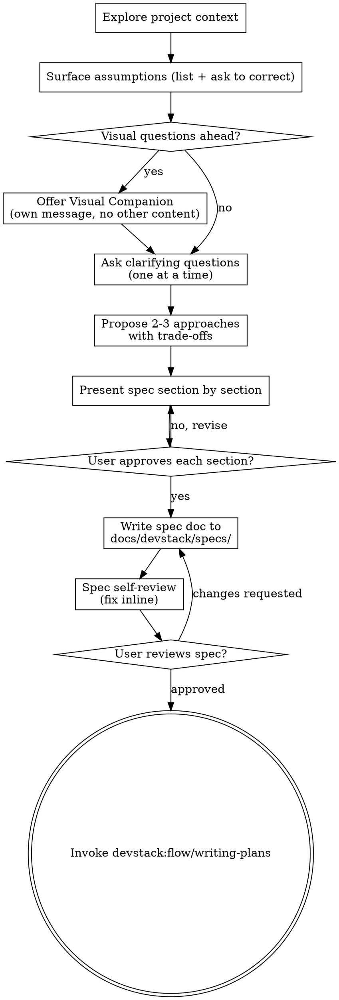

<!--
origin: [SP+AS]
sources:
  - superpowers:brainstorming @ 5.0.7
  - agent-skills:idea-refine @ 1.0.0
  - agent-skills:spec-driven-development @ 1.0.0
notes: |
  Kept SP's HARD-GATE, socratic questioning, visual-companion notion, per-section
  approval loop, and terminal handoff to writing-plans.
  Grafted AS's "Surface Assumptions" pattern as the opening move of the design phase.
  Adopted AS's six-area spec template (Objective / Tech Stack / Commands / Project Structure /
  Code Style / Testing Strategy / Boundaries / Success Criteria / Open Questions) as the
  output format — replacing SP's looser "architecture, components, data flow" guidance with
  AS's more concrete structure. Dropped AS idea-refine's Phase 1–3 taxonomy in favor of
  SP's conversational flow, but kept AS's "Not Doing" list as a required output section.
-->

# Brainstorming Ideas Into Approved Specs

Turn an idea into a written, approved specification through collaborative dialogue. The spec is the contract between you and your human partner — what you'll build, why, and how you'll know it's done.

<HARD-GATE>
Do NOT invoke any implementation skill, write any code, scaffold any project, or take any implementation action until you have presented a design and the user has approved it in writing. This applies to EVERY project regardless of perceived simplicity.
</HARD-GATE>

## Anti-Pattern: "This Is Too Simple To Need A Spec"

Every project goes through this process. A todo list, a single-function utility, a config change — all of them. "Simple" projects are where unexamined assumptions cause the most wasted work. The spec can be short (a few sentences) for truly simple projects, but you MUST present it and get written approval.

## Checklist

Create a TodoWrite task for each of these items and complete them in order:

1. **Explore project context** — files, docs, recent commits, existing patterns
2. **Surface assumptions** — list what you're assuming before asking anything
3. **Offer visual companion** (only if visual questions are coming) — its own message, no other content
4. **Ask clarifying questions** — one at a time, understand purpose / constraints / success criteria
5. **Propose 2–3 approaches** — with trade-offs and your recommendation
6. **Present design section by section** — get approval after each section
7. **Write the spec document** — save to `docs/devstack/specs/YYYY-MM-DD-<topic>-spec.md` and commit
8. **Spec self-review** — inline fix of placeholders, contradictions, ambiguity, scope drift
9. **User reviews written spec** — wait for explicit approval
10. **Hand off to writing-plans** — invoke `devstack:flow/writing-plans` as the terminal state

## Process Flow



**The terminal state is invoking `devstack:flow/writing-plans`.** Do NOT invoke any other implementation skill from here. writing-plans is the only next step.

## The Process

### 1. Explore Project Context

Before asking anything, look. Check directory structure, README, recent commits, existing patterns. If the project has conventions (naming, layering, testing), respect them. New projects: note that context is empty and proceed.

### 2. Surface Assumptions

Before clarifying questions, state what you're assuming — explicitly and in one block:

```
ASSUMPTIONS I'M MAKING:
1. This is a web application (not native mobile)
2. Authentication uses session cookies (based on existing /auth/session route)
3. The database is PostgreSQL (Prisma schema present)
4. Targeting modern browsers only
→ Correct me now or I'll proceed with these.
```

This is the single most effective way to prevent downstream rework. Do not silently fill in ambiguous requirements.

### 3. Assess Scope Early

If the request describes multiple independent subsystems ("build a platform with chat, file storage, billing, analytics"), **flag this immediately** — do not refine details of a project that needs decomposition. Help the user split into sub-projects; each sub-project gets its own spec → plan → implementation cycle.

### 4. Ask Clarifying Questions

- **One question per message.** Don't overwhelm.
- **Prefer multiple-choice.** Easier to answer than open-ended.
- **Focus on:** purpose, constraints, success criteria, who the user is, what "done" looks like.

### 5. Propose 2–3 Approaches

Lead with your recommendation and explain why. Give trade-offs honestly — don't rubber-stamp the first idea that came up.

### 6. Present the Spec Section by Section

Scale each section to its complexity. A few sentences for simple parts, up to 200–300 words for nuanced parts. Ask after each section: "Does this look right so far?"

### 7. Design for Isolation and Clarity

As you present the design:

- Break the system into smaller units, each with **one clear purpose**, communicating through **well-defined interfaces**, understandable and testable independently.
- For each unit, be able to answer: **what does it do, how do you use it, what does it depend on?**
- Smaller, well-bounded units are also easier for agents to implement — you reason better about code you can hold in context at once.
- In existing codebases, follow established patterns. Include targeted improvements when the code you're touching has problems that affect the work — but don't propose unrelated refactoring.

## The Spec Template

After approval per section, write the spec to `docs/devstack/specs/YYYY-MM-DD-<topic>-spec.md`. (User preferences override this default path.)

```markdown
# Spec: <Feature/Project Name>

> Status: Approved · <YYYY-MM-DD>

## Objective

What we're building and why. Who the user is. What success looks like.

## Tech Stack

Framework, language, key dependencies with versions.

## Commands

Full executable commands (not just tool names):
- Build: `npm run build`
- Test: `npm test -- --coverage`
- Lint: `npm run lint --fix`
- Dev: `npm run dev`

## Project Structure

Where source code lives, where tests go, where docs belong.

## Code Style

One real snippet + key conventions. (Shows beats describes.)

## Testing Strategy

Framework, test locations, coverage expectations, which test levels for which concerns.

## Architecture

Components, data flow, error handling. Diagram if useful. Scale to complexity.

## Success Criteria

Specific, testable conditions for "done". Not vague — "dashboard LCP < 2.5s on 4G",
not "make it faster".

## Boundaries

- **Always do:** Run tests before commits, follow naming conventions, validate inputs
- **Ask first:** Schema changes, new dependencies, changes to CI config
- **Never do:** Commit secrets, edit vendor directories, remove failing tests without approval

## Not Doing (and Why)

- [Feature X] — out of scope for MVP, revisit in v2
- [Feature Y] — explicitly rejected, see discussion on 2026-04-18
- [Feature Z] — blocked on [prerequisite]

## Open Questions

- [Question needing resolution before implementation]
- [Question that can wait until plan phase]
```

**The "Not Doing" list is non-negotiable.** Focus is saying no to good ideas. Make the trade-offs explicit.

**Reframe vague requests as success criteria.** When told "make the dashboard faster," translate to concrete: "LCP < 2.5s on 4G, initial data load < 500ms, CLS < 0.1 — are these the right targets?"

## Spec Self-Review

After writing the spec, look at it with fresh eyes:

1. **Placeholder scan** — any "TBD", "TODO", incomplete sections, or vague requirements? Fix them.
2. **Internal consistency** — do sections contradict each other? Does the architecture match the feature descriptions?
3. **Scope check** — is this focused enough for a single implementation plan, or does it need decomposition?
4. **Ambiguity check** — could any requirement be interpreted two ways? Pick one and make it explicit.
5. **Assumption audit** — any assumption from step 2 that didn't get confirmed? Flag it in Open Questions.

Fix issues inline. No need to re-review.

## User Review Gate

After self-review, ask:

> "Spec written and committed to `<path>`. Please review it and let me know if you want changes before we move to the implementation plan."

Wait. If the user requests changes, make them and re-run self-review. Only proceed once the user approves.

## Implementation Handoff

```
[User approves spec]

You: I'm using devstack:flow/writing-plans to create the implementation plan based on
     the approved spec at <path>.

[Invoke devstack:flow/writing-plans]
```

Do NOT invoke any other skill. `writing-plans` is the next step.

## Key Principles

- **One question at a time** — don't overwhelm
- **Multiple choice preferred** — easier to answer
- **YAGNI ruthlessly** — remove unnecessary features from all designs
- **Explore alternatives** — always 2–3 approaches before settling
- **Incremental validation** — present, approve, move on
- **Surface assumptions early** — cheaper than rework
- **Be flexible** — go back and clarify when something doesn't make sense
- **Don't be a yes-machine** — if the idea is weak, say so with kindness and specificity

## Red Flags

- Starting to write code with no written spec
- Skipping "Surface Assumptions" because "the request seems clear"
- Batching multiple clarifying questions into one message
- Writing a spec without a "Not Doing" list
- Accepting vague success criteria like "make it faster"
- Jumping to implementation after verbal approval — get written spec approval
- Invoking any skill other than `writing-plans` as the terminal state

## Visual Companion (optional)

A browser-based companion for showing mockups, diagrams, and visual options during brainstorming. This is a tool, not a mode — accepting it means it's available for questions that benefit from visual treatment, not that every question goes through a browser.

**When to offer:** Only when you anticipate upcoming questions involving visual content (mockups, layouts, wireframes, architecture diagrams). Offer exactly once, in its own message with no other content:

> "Some of what we're working on might be easier to explain if I can show it to you in a web browser. I can put together mockups, diagrams, and side-by-side visual comparisons as we go. Want to try it? (Requires opening a local URL.)"

Wait for the user's response before continuing. If declined, proceed with text-only brainstorming.

**Per-question decision:** Even after acceptance, decide for EACH question whether browser or terminal is better. Test: *would the user understand this better by seeing it than reading it?*

- **Browser:** mockups, wireframes, layout comparisons, architecture diagrams
- **Terminal:** requirements questions, conceptual choices, trade-off lists, A/B/C/D text options

A question about a UI topic is not automatically a visual question. "What does 'personality' mean in this context?" is conceptual — use the terminal. "Which wizard layout works better?" is visual — use the browser.
