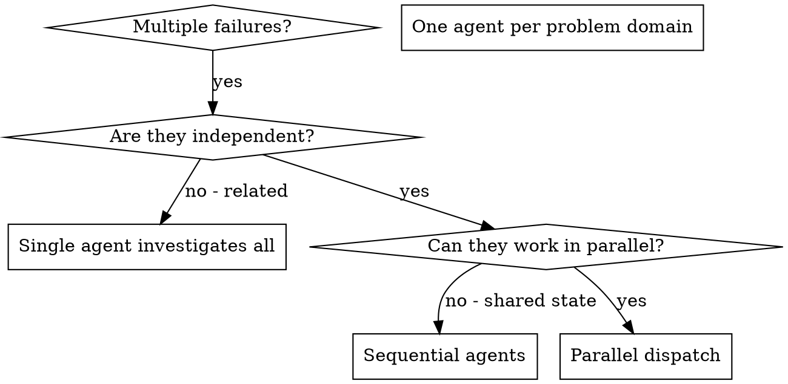

<!--
origin: [SP+MP]
sources:
  - superpowers:dispatching-parallel-agents @ 5.0.7
  - mattpocock-skills:improve-codebase-architecture/INTERFACE-DESIGN.md @ 2026-04-26
notes: SP base port (one agent per independent problem domain). Grafted MP "Design It Twice" pattern as a named application of the parallel-dispatch primitive — three or more agents produce radically different interface designs in parallel for the same deepening candidate, then the orchestrator compares and recommends.
-->

# Dispatching Parallel Agents

## Overview

You delegate tasks to specialized agents with isolated context. By precisely crafting their instructions and context, you ensure they stay focused and succeed. They should never inherit your session's context — you construct exactly what they need. This also preserves your own context for coordination work.

When you have multiple unrelated failures (different test files, different subsystems, different bugs), investigating them sequentially wastes time. Each investigation is independent and can happen in parallel.

**Core principle:** One agent per independent problem domain. Let them work concurrently.

## When to Use



**Use when:**
- 3+ test files failing with different root causes
- Multiple subsystems broken independently
- Each problem can be understood without context from others
- No shared state between investigations

**Don't use when:**
- Failures are related (fix one might fix others)
- Need to understand full system state
- Agents would interfere with each other (same files, same resources)

## The Pattern

### 1. Identify Independent Domains

Group failures by what's broken:
- File A tests: tool approval flow
- File B tests: batch completion behavior
- File C tests: abort functionality

Each domain is independent — fixing tool approval doesn't affect abort tests.

### 2. Create Focused Agent Tasks

Each agent gets:
- **Specific scope** — one test file or subsystem
- **Clear goal** — make these tests pass
- **Constraints** — don't change other code
- **Expected output** — summary of what you found and fixed

### 3. Dispatch in Parallel

Make all Task tool calls in a single message to run concurrently:

```
Task("Fix agent-tool-abort.test.ts failures")
Task("Fix batch-completion-behavior.test.ts failures")
Task("Fix tool-approval-race-conditions.test.ts failures")
```

### 4. Review and Integrate

When agents return:
- Read each summary
- Verify fixes don't conflict (did two agents edit the same file?)
- Run full test suite
- Integrate all changes

## Agent Prompt Structure

Good agent prompts are:
1. **Focused** — one clear problem domain
2. **Self-contained** — all context needed to understand the problem
3. **Specific about output** — what should the agent return?

```markdown
Fix the 3 failing tests in src/agents/agent-tool-abort.test.ts:

1. "should abort tool with partial output capture" — expects 'interrupted at' in message
2. "should handle mixed completed and aborted tools" — fast tool aborted instead of completed
3. "should properly track pendingToolCount" — expects 3 results but gets 0

These are timing / race condition issues. Your task:

1. Read the test file and understand what each test verifies
2. Identify root cause — timing issues or actual bugs?
3. Fix by:
   - Replacing arbitrary timeouts with event-based waiting
   - Fixing bugs in abort implementation if found
   - Adjusting test expectations if testing changed behavior

Do NOT just increase timeouts — find the real issue.

Return: summary of root cause and changes.
```

## Common Mistakes

| Mistake | Fix |
|---|---|
| "Fix all the tests" | Scope per agent — "Fix agent-tool-abort.test.ts" |
| No context | Paste the error messages and test names |
| No constraints | "Do NOT change production code" or "Fix tests only" |
| Vague output | "Return summary of root cause and changes" |

## When NOT to Use

- **Related failures:** fixing one might fix others — investigate together first
- **Need full context:** understanding requires the whole system
- **Exploratory debugging:** you don't know what's broken yet
- **Shared state:** agents would interfere (same files, same resources)

## Verification After Agents Return

1. **Review each summary** — understand what changed
2. **Check for conflicts** — did agents edit the same code?
3. **Run the full suite** — verify all fixes work together
4. **Spot-check** — agents can make systematic errors

## Key Benefits

1. **Parallelization** — multiple investigations simultaneously
2. **Focus** — each agent has narrow scope, less context to track
3. **Independence** — agents don't interfere with each other
4. **Speed** — 3 problems in the time of 1

## Pattern: Design It Twice

A specialised application of parallel dispatch — instead of N agents fixing N independent failures, N agents propose N **radically different** designs for one problem. From Ousterhout's "Design It Twice": your first idea is unlikely to be the best.

**When to use:** the user has chosen a deepening candidate from `devstack:flow/improving-architecture` and wants to explore alternative interfaces before committing. Also useful for: API redesigns, new module shapes, anything where the seam placement is itself the question.

**Process:**

1. **Frame the problem space** for the user — constraints, dependencies (and their category from `devstack:flow/improving-architecture/DEEPENING.md`), an illustrative code sketch. Show this; the user reads while agents work.
2. **Spawn 3+ agents in parallel.** Each gets a different design constraint:
   - Agent 1: minimize the interface (1–3 entry points, maximise leverage per entry).
   - Agent 2: maximise flexibility (many use cases, extension points).
   - Agent 3: optimise for the most common caller (default case trivial).
   - Agent 4 (if applicable): ports & adapters around cross-seam dependencies.
3. **Each agent outputs:** the interface (types, methods, invariants, ordering, errors), a usage example, what the implementation hides behind the seam, dependency strategy + adapters, and trade-offs.
4. **Present designs sequentially.** Then compare in prose by depth (leverage at the interface), locality (where change concentrates), and seam placement.
5. **Give your own recommendation** — opinionated. Propose a hybrid if elements combine well.

The full prompt brief, including the architecture vocabulary every agent must use, lives in `devstack:flow/improving-architecture/INTERFACE-DESIGN.md`.
