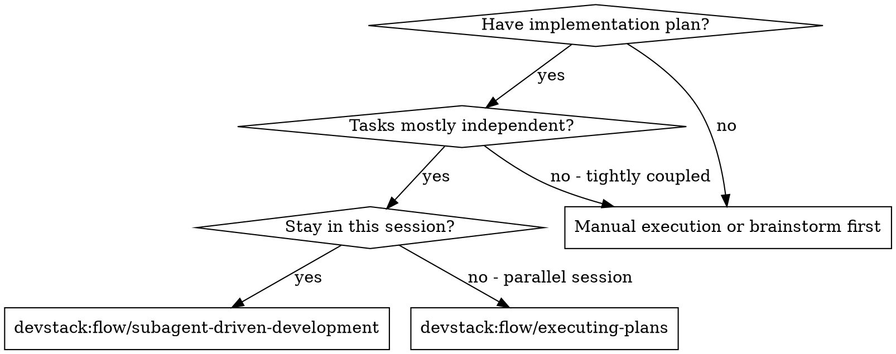
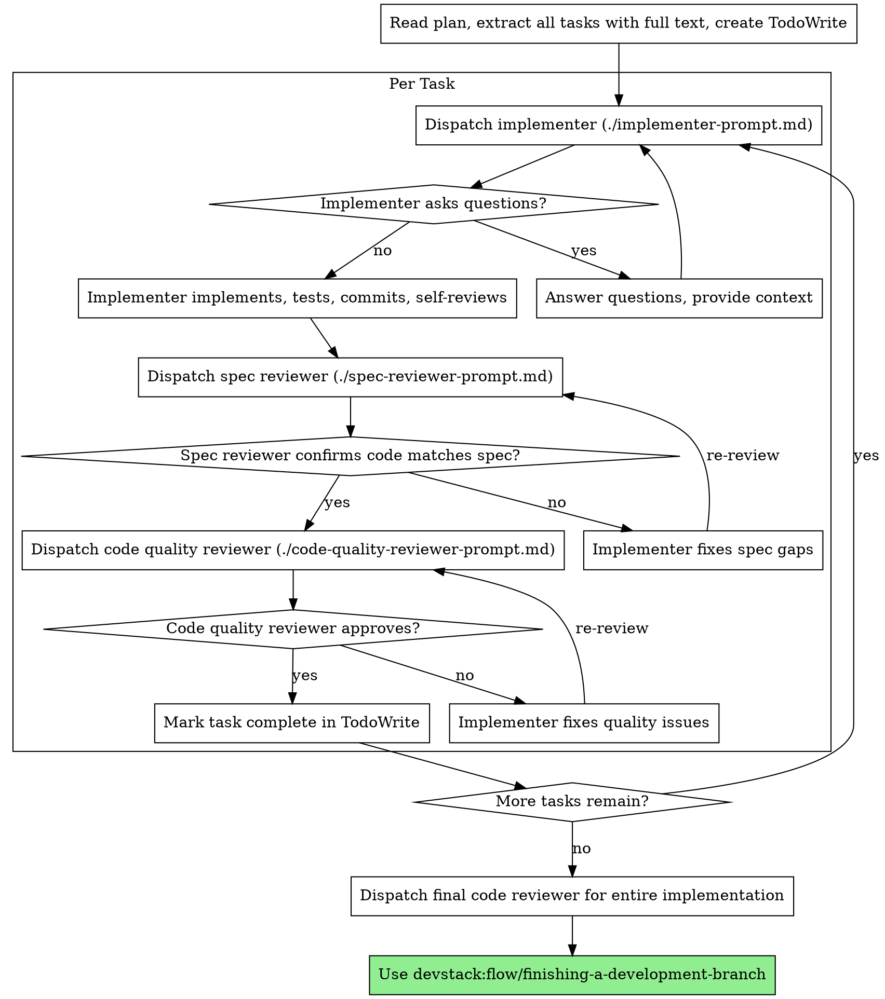

<!--
origin: [SP]
sources:
  - superpowers:subagent-driven-development @ 5.0.7
notes: |
  Direct port. Namespace rewritten. Plan path reference changed from
  docs/superpowers/ to docs/devstack/. Supporting prompt templates live in
  ./implementer-prompt.md, ./spec-reviewer-prompt.md, ./code-quality-reviewer-prompt.md
  and are adaptations of the SP originals.
-->

# Subagent-Driven Development

Execute a plan by dispatching a fresh subagent per task, with a two-stage review after each task: spec compliance review first, then code quality review.

**Why subagents:** You delegate tasks to specialized agents with isolated context. By precisely crafting their instructions, you ensure they stay focused. They should never inherit your session's context — you construct exactly what they need. This also preserves your own context for coordination work.

**Core principle:** Fresh subagent per task + two-stage review (spec then quality) = high quality, fast iteration.

## When to Use

**vs. `executing-plans`:**
- Same session (no context switch)
- Fresh subagent per task (no context pollution)
- Two-stage review after each task: spec compliance first, then code quality
- Faster iteration (no human-in-loop between tasks)

## The Process

## Model Selection

Use the least powerful model that can handle each role to conserve cost and increase speed.

- **Mechanical implementation** (isolated functions, clear specs, 1–2 files) — fast cheap model
- **Integration / judgment** (multi-file coordination, pattern matching, debugging) — standard model
- **Architecture / design / review** — most capable available model

**Task complexity signals:**
- Touches 1–2 files with complete spec → cheap model
- Touches multiple files with integration concerns → standard model
- Requires design judgment or broad codebase understanding → most capable model

## Handling Implementer Status

Implementers report one of four statuses:

**DONE** — Proceed to spec compliance review.

**DONE_WITH_CONCERNS** — The implementer completed the work but flagged doubts. Read concerns before proceeding. If about correctness or scope, address them before review. If observations ("this file is getting large"), note and proceed.

**NEEDS_CONTEXT** — The implementer needs information that wasn't provided. Provide it and re-dispatch.

**BLOCKED** — The implementer cannot complete the task. Assess the blocker:
1. Context problem → provide more context, re-dispatch with same model
2. Requires more reasoning → re-dispatch with more capable model
3. Task too large → break into smaller pieces
4. Plan itself is wrong → escalate to the human

**Never** ignore an escalation or force the same model to retry without changes.

## Prompt Templates

Use the templates in this skill's directory:

- `./implementer-prompt.md` — dispatch implementer subagent
- `./spec-reviewer-prompt.md` — dispatch spec compliance reviewer
- `./code-quality-reviewer-prompt.md` — dispatch code quality reviewer

## Red Flags

**Never:**
- Start implementation on `main` / `master` without explicit user consent
- Skip either review (spec compliance OR code quality)
- Proceed with unfixed issues
- Dispatch multiple implementation subagents in parallel (conflicts)
- Make subagent read the plan file — provide full task text instead
- Skip scene-setting context (subagent needs to know where the task fits)
- Ignore subagent questions — answer before they proceed
- Accept "close enough" on spec compliance
- Skip review loops — if the reviewer found issues, fix and re-review
- Let implementer self-review replace actual review (both needed)
- Start code quality review before spec compliance is ✅
- Move to next task while either review has open issues

**If subagent asks questions:** answer clearly and completely. Don't rush them into implementation.

**If reviewer finds issues:** implementer (same subagent) fixes; reviewer reviews again; repeat until approved.

**If subagent fails:** dispatch a fix subagent with specific instructions. Don't try to fix manually — context pollution.

## Integration

**Required workflow skills:**
- `devstack:flow/using-git-worktrees` — REQUIRED: isolated workspace before starting
- `devstack:flow/writing-plans` — creates the plan this skill executes
- `devstack:flow/requesting-code-review` — the final code-reviewer subagent after all tasks
- `devstack:flow/finishing-a-development-branch` — complete development after all tasks

**Subagents should use:**
- `devstack:core/test-driven-development` — implementers follow TDD for each task

**Alternative workflow:**
- `devstack:flow/executing-plans` — use when subagents aren't available, or for parallel session execution
