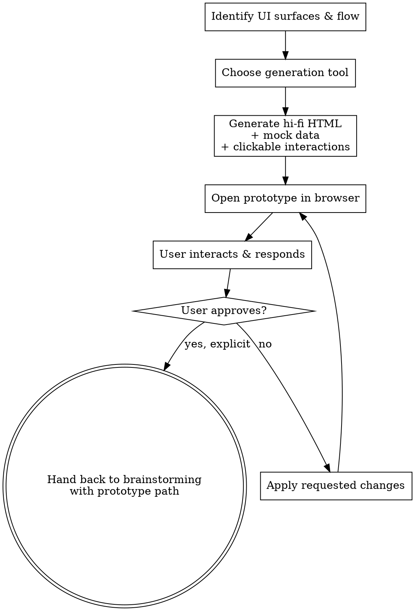

<!--
origin: [NEW]
inspired_by:
  - gstack:design-shotgun (multi-variant exploration)
  - gstack:frontend-design (hi-fi HTML generation)
  - gstack:design-html (Pretext-native HTML/CSS finalization)
notes: |
  Original to devstack. Inserts a prototype-driven approval gate between
  brainstorming's "propose approaches" step and spec-writing. The HTML prototype
  becomes the source of truth for visual/interaction decisions; the written spec
  references it instead of describing it in prose. Reuses any available hi-fi
  HTML skill when present (frontend-design, design-html), otherwise writes HTML
  directly. Browser preview reuses devstack:browser-testing-with-devtools or any
  available playwright/browse MCP, otherwise prints a file:// URL the user opens.
-->

# Prototyping With HTML

Turn an in-progress UI design into a clickable, hi-fi HTML prototype that the user opens in a real browser, interacts with, and approves. The approved prototype becomes the **visual contract** the spec references — not a paragraph of UI prose.

<HARD-GATE>
For UI features, do NOT write the spec's UI description, jump to writing-plans, or scaffold any production code until the user has opened the prototype in a browser AND approved it in writing. "Approval" means an explicit "looks good / ship it / approved" — not silence and not "looks OK, but…". If the user requests changes, iterate the prototype and ask again.
</HARD-GATE>

## When to Use

Invoked by `devstack:brainstorming` when the feature has a **visible end-user surface**:

- Web pages, dashboards, marketing sites
- App screens, modals, wizards, forms
- Component libraries with visible primitives
- Any flow where a human will look at pixels and click things

**Skip this skill** when the feature has no visual surface:

- CLI tools, daemons, cron jobs
- Backend APIs consumed only by other code
- Library/SDK internals
- Database migrations, schema changes
- Infrastructure / CI / build tooling

If you're unsure, ask the user one question: *"Will an end user look at pixels and click things? If yes, we'll prototype in HTML first."*

## What "Hi-Fi" Means Here

Not lorem ipsum. Not gray boxes. The prototype should look like a screenshot of the shipped product:

- Real strings (the actual button labels, headings, empty-state copy)
- Realistic mock data (plausible names, dates, numbers, lengths)
- Production-grade typography, spacing, and color
- Hover/focus/active states for interactive elements
- Clickable links between pages/screens that exist in the flow
- Loading/empty/error states for at least one canonical case

**Mock data, not real data.** No backend calls. Everything client-side. No persistence beyond `localStorage` if a stateful interaction is being demonstrated.

## Process

Create a TodoWrite task per item. Work in order.

1. **Identify the UI surfaces** — what screens / pages / modals does this feature touch? List them.
2. **Identify the canonical user flow** — the happy path the prototype must support clicking through.
3. **Choose generation tool** — prefer an available hi-fi HTML skill, otherwise write HTML directly (see [Generation Tools](#generation-tools)).
4. **Generate the prototype** — save to `docs/devstack/prototypes/<topic>/index.html` plus any sibling pages.
5. **Add realistic mock data** — populate every visible element with content that resembles real production data.
6. **Wire interactions** — clickable links between pages, hover states, form submission to a "success" page, at least one empty/loading/error state.
7. **Open the prototype in a browser** — use [Browser Preview](#browser-preview) to give the user a URL they can open right now.
8. **Capture feedback** — wait for the user to interact and respond. Ask one focused question per round (see [Feedback Loop](#feedback-loop)).
9. **Iterate** — apply changes, re-open, ask again. Keep going until the user explicitly approves.
10. **Hand back to brainstorming** — return the prototype path + a short Visual Contract note for the spec.

## Process Flow



## Generation Tools

Prefer an existing skill if present in the environment:

| Tool                              | Use for                                          |
|-----------------------------------|--------------------------------------------------|
| `frontend-design` (gstack)        | Hi-fi distinctive UIs that avoid AI-slop look    |
| `design-html` (gstack)            | Production-quality dynamic HTML/CSS              |
| `design-shotgun` (gstack)         | Multiple variants for side-by-side comparison    |
| Direct HTML/CSS                   | Fallback when none of the above are available    |

If you write HTML directly, follow these defaults:

- One `index.html` plus sibling pages (`settings.html`, `detail.html`, etc.) — flat, no build step
- Inline `<style>` block at top, or one `styles.css` sibling — no preprocessor
- Inline `<script>` for interactions and mock data — no bundler, no framework
- Use a system font stack and modern CSS (grid, flexbox, custom properties)
- Keep it self-contained: a user can `open index.html` and the whole prototype works

**Never use a build step for prototypes.** A prototype that requires `npm install` defeats its own purpose.

## Browser Preview

Three options, in preference order:

1. **`devstack:browser-testing-with-devtools`** — if the project already uses it, hand off the prototype path
2. **Available playwright/browse MCP** (e.g., `playwright`, gstack `browse`) — open the file URL programmatically and snapshot for the user
3. **Plain file URL** — print `open docs/devstack/prototypes/<topic>/index.html` and ask the user to run it

Always print the URL alongside any programmatic preview, so the user can re-open it themselves between rounds without your help.

## Feedback Loop

After opening the prototype, ask **one focused question** at a time:

- "Try clicking through the empty-state flow on the projects page. Does the empty-state copy land?"
- "On a 1280-wide window, the sidebar is 240px. Want it wider, narrower, or that?"
- "I added a destructive-action confirmation modal. Open the delete button on the first row. Right friction level?"

**Avoid:**

- "What do you think?" — too vague, generates vague feedback
- Multiple questions in one message — user can only answer one well
- Asking about things the prototype doesn't yet show — build it first

When the user requests a change:

1. Make the change
2. Reopen the file (or hot-reload if your preview supports it)
3. Confirm what changed in one sentence: *"Sidebar widened to 280px and added a collapse toggle."*
4. Ask the next question

## Approval Gate

Approval is **explicit and written**:

- ✅ "Approved", "ship it", "looks good — proceed", "this is what I want"
- ❌ "Looks OK", "I guess that works", silence, "let's just move on" — these are NOT approvals; ask again or surface what's making the user hesitant

When approved, summarize what you're locking in (1–3 bullets) and write the Visual Contract note (next section).

## Visual Contract Note

Hand back to `devstack:brainstorming` with this payload:

```markdown
## Visual Contract

**Prototype:** `docs/devstack/prototypes/<topic>/index.html`
**Approved:** <YYYY-MM-DD>

**Surfaces locked in:**
- <page/screen 1> — <one-line purpose>
- <page/screen 2> — <one-line purpose>

**Interaction decisions worth calling out:**
- <decision 1, e.g., "Destructive actions use a confirm modal, not inline confirm">
- <decision 2, e.g., "Empty state shows a single CTA, not multiple options">

**Out of scope for this prototype:**
- <thing 1 deliberately not shown>
- <thing 2 deferred to v2>
```

This block goes into the spec under a `## Visual Contract` heading. The rest of the spec (data model, API, success criteria, boundaries) is written normally — but UI prose is replaced by a pointer to the prototype.

## Anti-Patterns

- **Lorem ipsum or `Lorem ipsum dolor sit amet`** — write real-looking copy
- **Dead links** in the canonical flow — every link the user clicks must go somewhere
- **One-screen prototype for a multi-screen flow** — show the flow, not just a snapshot
- **Skipping mobile when mobile is in scope** — at minimum, set up a `@media` query and verify at 390px
- **Build step / npm install required** — defeats the point of a prototype
- **Asking "what do you think?"** instead of one focused question
- **Treating "looks OK" as approval** — push for explicit yes
- **Re-describing the prototype in spec prose** — the prototype IS the description; spec only captures non-visual contracts

## Red Flags

- Writing the spec's UI section before the prototype is approved
- Generating a prototype with placeholder text and asking the user to "imagine the real content"
- Building screens that aren't part of the canonical flow because they "might be useful later" — out of scope
- Using a real backend or real user data in the prototype
- Iterating more than ~5 rounds without convergence — stop, ask the user what's structurally wrong

## Iteration Budget

If you've done 5+ rounds and the user is still requesting major changes, **stop iterating** and ask one structural question:

> "We've been iterating on details for a while. Is there a structural decision we got wrong upfront — wrong layout, wrong information architecture, wrong primary flow? I'd rather rebuild than keep patching."

Better to throw out and restart than burn 20 rounds polishing the wrong shape.

## Handoff

```
[User explicitly approves prototype]

You: Prototype approved at docs/devstack/prototypes/<topic>/index.html.
     Returning to devstack:brainstorming with the Visual Contract note for
     the spec. The spec will reference the prototype path instead of
     re-describing the UI in prose.

[Continue brainstorming with section 6 onward, using the Visual Contract
 note as the UI portion of the spec]
```
