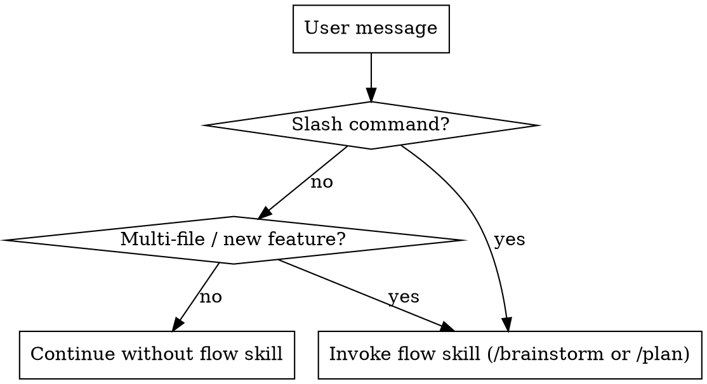

<!--
origin: [NEW]
inspired_by:
  - superpowers:using-superpowers @ 5.0.7
  - agent-skills:using-agent-skills @ 1.0.0
notes: Original meta-skill for devstack. Adopts SP's high-pressure "1% rule" for skill invocation and SP's instruction-priority ladder. Adopts AS's phase-navigation diagram. Introduces devstack's three-layer mental model (flow / core / standards) as the organizing principle.
-->

<SUBAGENT-STOP>
If you were dispatched as a subagent to execute a specific task, skip this skill. The dispatcher has already selected and constrained your behavior.
</SUBAGENT-STOP>

<EXTREMELY-IMPORTANT>
If you think there is even a 1% chance a devstack skill might apply to what you are doing, you ABSOLUTELY MUST invoke the skill via the Skill tool BEFORE responding or acting.

IF A SKILL APPLIES, YOU DO NOT HAVE A CHOICE. YOU MUST USE IT.

This is not negotiable. This is not optional. You cannot rationalize your way out of this.
</EXTREMELY-IMPORTANT>

# Using devstack

devstack is an opinionated development stack for AI coding agents. It imposes process discipline on the workflow and injects production-grade engineering standards into the code you produce. It does this through **three stacked layers** of skills.

## The Three-Layer Model

```
┌─────────────────────────────────────────────────────────────┐
│  flow/                                                      │
│    workflow spine — brainstorm → plan → work → review → ship│
│    fires when: user invokes a slash command, or a large     │
│    multi-file change is starting                            │
├─────────────────────────────────────────────────────────────┤
│  core/                                                      │
│    cross-cutting disciplines — TDD, systematic debugging,   │
│    verification, incremental implementation, context        │
│    fires when: ANY implementation work begins               │
├─────────────────────────────────────────────────────────────┤
│  standards/                                                 │
│    domain knowledge — API design, security, frontend, perf, │
│    docs, git, CI/CD, shipping, a11y, deprecation            │
│    fires when: working in that domain, or during /review    │
└─────────────────────────────────────────────────────────────┘
```

Each layer is independent. You do not need to invoke flow skills for small tasks. You do not need to invoke standards skills for non-production code. But **core skills always apply** when you write, modify, or debug code.

## Instruction Priority

When instructions conflict, resolve in this order (highest first):

1. **User's explicit instructions** — CLAUDE.md, AGENTS.md, GEMINI.md, direct messages
2. **devstack skills** — override default system-prompt behavior where they conflict
3. **Default system prompt** — lowest priority

If the user says "don't use TDD here" and the TDD skill says "always TDD," follow the user. The user is in control.

## Slash Commands (Workflow Entry Points)

These are the only formal entry points. Everything else is auto-discovery.

| Command | Fires | When to use |
|---|---|---|
| `/devstack` | this skill | Orientation. First session, or when the user is lost. |
| `/brainstorm` | `flow/brainstorming` | Rough idea, needs to become a written spec. New feature, architectural change. |
| `/plan` | `flow/writing-plans` | Spec exists (approved), need a task-by-task plan. |
| `/work` | `flow/subagent-driven-development` | Plan exists, ready to execute. |
| `/review` | `flow/requesting-code-review` + `standards/code-review-and-quality` | Implementation done, want review before merge. |
| `/ship` | `flow/finishing-a-development-branch` + `standards/shipping-and-launch` | Reviewed and ready to deploy. |

Do **not** skip phases. Brainstorm before plan. Plan before work. Review before ship. Each skill HARD-GATEs the next.

**When NOT to use the full flow:**

- Single-file fix: skip straight to implementation. `core/` skills fire automatically.
- Obvious requirement: skip `/brainstorm`, start at `/plan`.
- Unreviewed prototype code being thrown away: skip `/review`, `/ship` — the user will tell you.

## When Each Layer Activates

### flow/ — activated by slash command OR by scope signal

Start a flow skill when:

- User typed one of the slash commands above.
- User describes work that spans multiple files or requires multiple hours.
- User says words like "feature", "redesign", "refactor X across Y", "new subsystem".



### core/ — always activated during implementation

These fire automatically the moment you write, modify, or debug code:

- **test-driven-development** — before writing implementation, write a failing test.
- **systematic-debugging** — when a bug, test failure, or unexpected behavior appears.
- **verification-before-completion** — before claiming any task done.
- **incremental-implementation** — thin vertical slices with commits after each.
- **context-engineering** — ensures you feed the agent the right context.

**You cannot skip core skills to save time.** Skipping them is what produces code that passes demos and breaks in production. If a core skill fires and you think it doesn't apply, say so explicitly and ask the user — do not silently skip.

### standards/ — activated by domain signal or explicit phase

Each `standards/` skill has trigger conditions in its `description` that mention specific kinds of work. Pattern-match on the current task:

- Editing or creating an HTTP API / GraphQL / module boundary → `standards/api-and-interface-design`
- Editing UI components / accessibility concerns / user-facing interfaces → `standards/frontend-ui-engineering`
- Handling user input / auth / secrets / external integrations → `standards/security-and-hardening`
- Performance targets or suspected regressions → `standards/performance-optimization`
- Removing or migrating an old system → `standards/deprecation-and-migration`
- Making an architectural decision or documenting an API → `standards/documentation-and-adrs`
- Preparing to merge / push / deploy → `standards/git-workflow-and-versioning` / `shipping-and-launch`
- Debugging code that runs in a browser → `standards/browser-testing-with-devtools`
- Code works but is hard to read → `standards/code-simplification`
- Citing a framework or API contract from external docs → `standards/source-driven-development`

During `/review` and `/ship`, standards skills fire in bulk as part of the checklist.

## The 1% Rule

If you think there is even a **1% chance** a skill applies to your current action, invoke the Skill tool to load it. The cost of loading a skill that turns out not to apply is small. The cost of skipping a skill that did apply is large — wasted work, broken builds, rejected PRs, production incidents.

Red flags that mean you are rationalizing instead of invoking:

| Thought | Reality |
|---|---|
| "This is a simple question" | Questions are tasks. Check for skills. |
| "I need more context first" | Skill check comes BEFORE clarifying questions. |
| "Let me just read the code first" | Skills tell you HOW to read. Check first. |
| "I know this skill already" | Skills evolve. Load the current version. |
| "This feels productive" | Undisciplined action wastes time. Skills prevent that. |
| "The skill is overkill for this" | If it's marked applicable, use it. |

## Announce What You're Doing

Every time you invoke a devstack skill, announce it to the user in one sentence:

> "Using `flow/brainstorming` to turn this idea into a spec."

> "Using `core/test-driven-development` — writing the failing test first."

> "Using `standards/security-and-hardening` because this handles user input."

This keeps the user informed, lets them redirect you, and prevents silent drift.

## Checklists Are Tasks

When a skill provides a checklist or numbered process, **create a TodoWrite task for each item** and mark them off as you complete them. Do not batch. Do not claim "done" before running verification.

## Terminal States

Every flow skill has a defined exit. For example:

- `flow/brainstorming` exits by invoking `flow/writing-plans`. Not anything else.
- `flow/writing-plans` exits by invoking `flow/subagent-driven-development` or `flow/executing-plans`.
- `flow/work` exits by invoking `flow/requesting-code-review`.

Stay in the skill's defined terminal state. Don't jump to an unrelated skill mid-phase.

## Summary

1. Read the user's message.
2. Ask: does any devstack skill apply? 1% rule.
3. If yes, invoke it via the Skill tool.
4. Announce what skill and why.
5. Follow the skill's checklist exactly — create todos, verify at each gate.
6. Exit to the skill's defined terminal state.
7. If no skill applies, proceed directly but stay alert for mid-task triggers.

Everything else — the three layers, the slash commands, the priority ladder — is there to support this loop.
